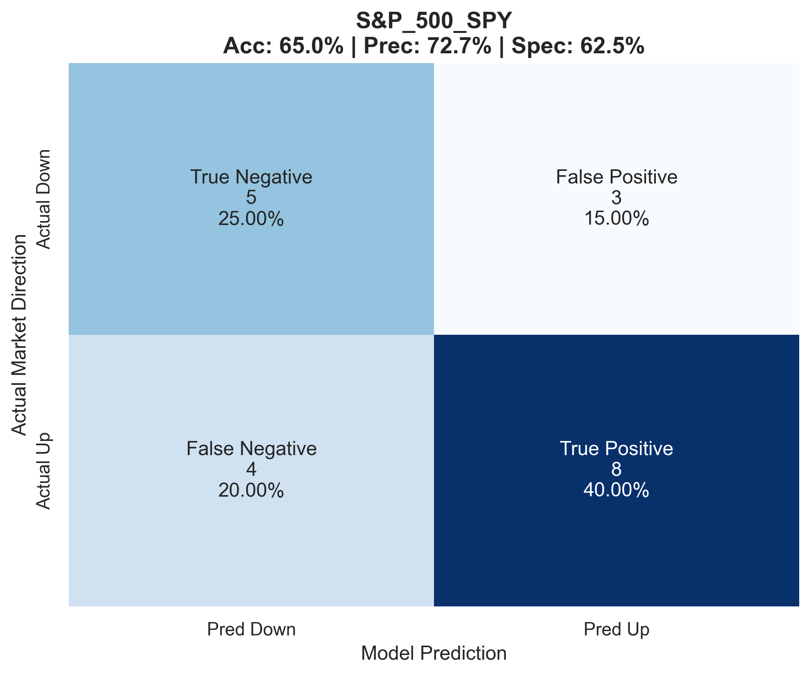
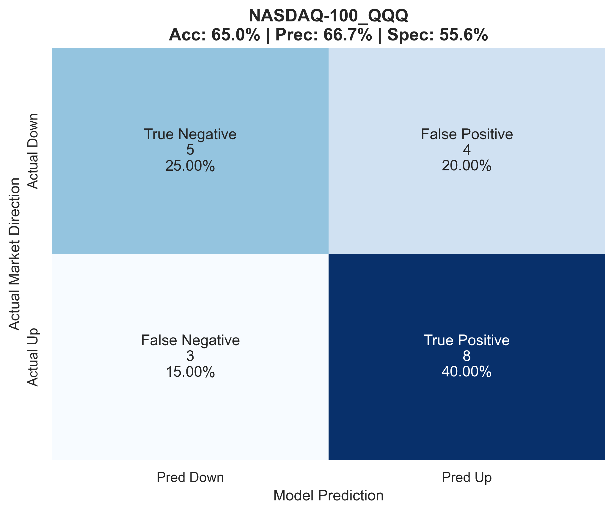
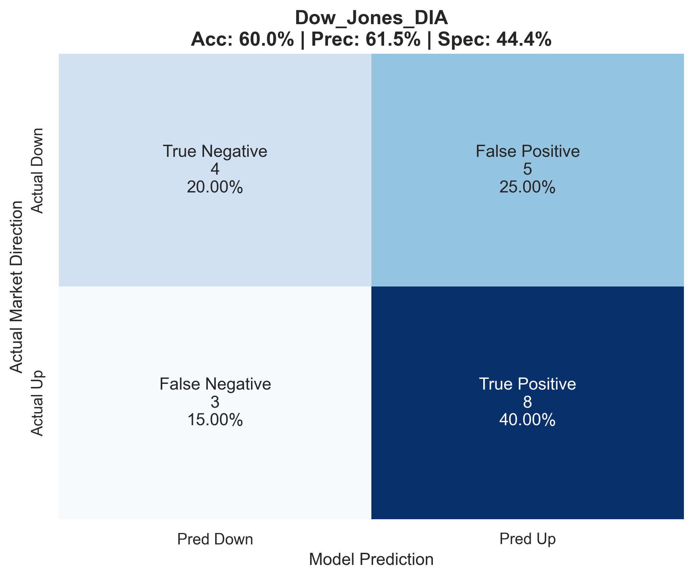
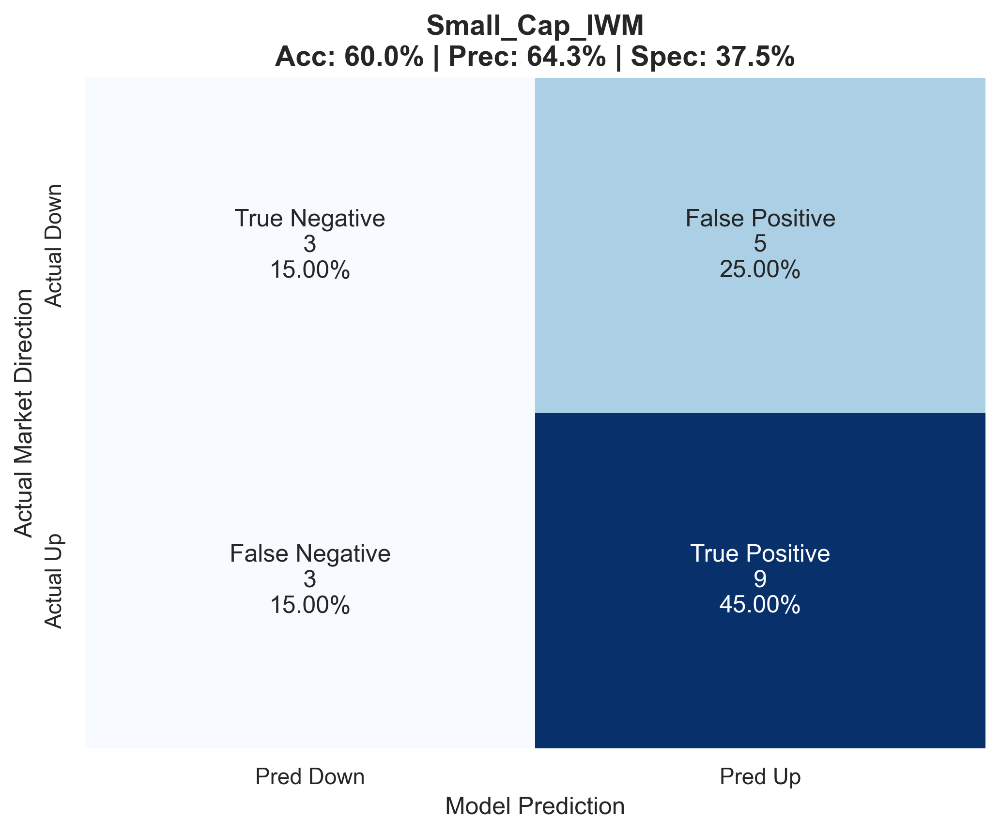
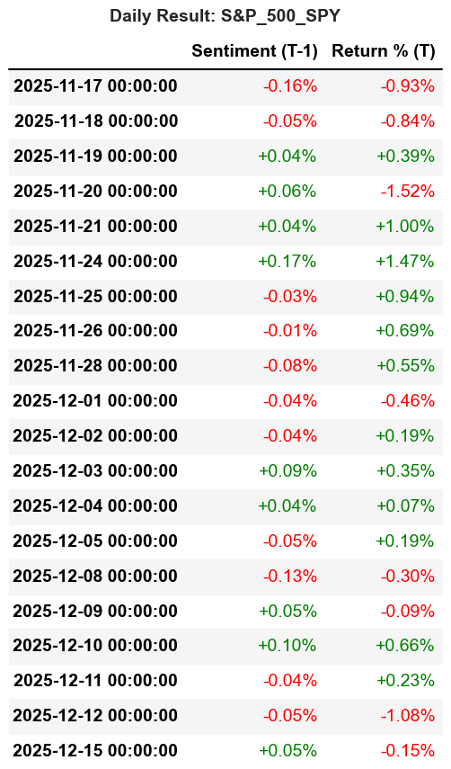
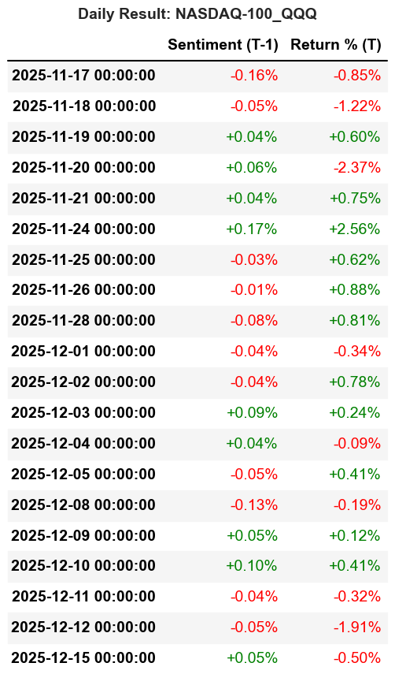
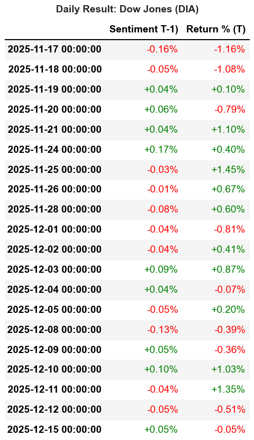
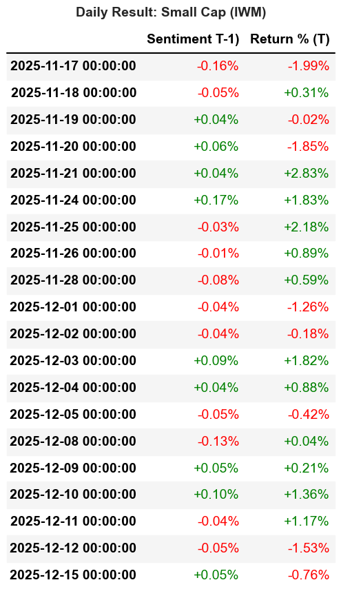

# Financial News Sentiment Analysis & Stock Correlation

## 📖 專案簡介 (Project Overview)
本專案旨在利用自然語言處理 (NLP) 技術分析財經新聞的情緒，並探討該情緒指標與美股主要指數（S&P 500, NASDAQ, Dow Jones, Russell 2000）之間的相關性。

## 💾 資料來源 (Data Source)
本專案使用兩類不同的資料來源：

### 1. 模型訓練資料 (Model Fine-Tuning Data)
* **來源**: [Kaggle - Sentiment Analysis for Financial News](https://www.kaggle.com/datasets/ankurzing/sentiment-analysis-for-financial-news?select=all-data.csv)
* **描述**: 使用該資料集中的 4,846 筆帶有情緒標籤（Positive, Neutral, Negative）的財經新聞標題，對 BERT 模型進行微調 (Fine-tuning)，使其具備判讀財經文本情緒的能力。

### 2. 市場分析資料 (Market Analysis Data)
本專案針對**過去 30 天**的市場動態進行分析，數據獲取分為文本與數值兩條路徑：

* **新聞文本 (News Text Data)**
    * **來源**: Google News (透過爬蟲技術獲取)
    * **範圍**: 過去 30 天
    * **用途**: 獲取標題與摘要，輸入微調後的 BERT 模型以計算每日情緒分數 (Sentiment Score)。

* **市場數值 (Stock Market Data)**
    * **來源**: Yahoo Finance (透過 `yfinance` API)
    * **範圍**: 過去 30 天
    * **用途**: 獲取目標指數的每日收盤價 (Close Price) 與成交量，用於與情緒指標進行時間序列對齊與相關性分析。
  
## 🛠️ 技術棧 (Tech Stack)
* **語言**: Python 3.x
* **數據處理**: Pandas, NumPy
* **統計分析**: Statsmodels (Dynamic Logit, Hypothesis Testing)
* **NLP 框架**: Hugging Face Transformers, PyTorch
* **NLP 模型**: FinBERT (Financial Bidirectional Encoder Representations from Transformers)
* **視覺化**: Matplotlib, Seaborn
* **資料來源**: Yahoo Finance (`yfinance`), Google News (`GoogleNews`), Kaggle Dataset

## 專案結構 (Project Structure)
本專案依照數據處理流程分為四個主要步驟：

1.  **01_scraper.ipynb**: 
    * 負責從財經新聞網站爬取標題與內文。
    * 資料清洗與初步格式化。
2.  **02_bert_training.ipynb**: 
    * 載入預訓練 BERT 模型。
    * 針對財經文本進行微調 (Fine-tuning)。
3.  **03_inference.ipynb**: 
    * 將爬取的新聞資料輸入模型，計算情緒分數 (Sentiment Score)。
4.  **04_analysis.ipynb**: 
    * 整合情緒分數與股價數據。
    * 進行時間序列分析與相關性檢定。
    * 產出視覺化圖表。
  
##  情緒指標建構 (Sentiment Index Construction)
為了確保分析的穩健性 (Robustness)，本專案採用兩種不同的模式將新聞文本轉化為每日情緒指標：

### 模式一：基於離散標籤 (Discrete Classification)
* **方法**: 將每一則新聞標題強制分類為 **Positive (正面)**、**Negative (負面)** 或 **Neutral (中立)** 三類。
* **每日聚合 (Aggregation)**: 採用 **Bullish Ratio (看漲比率)** 計算當日市場情緒，忽略中立新聞的影響。
* **公式**:
    $$B_t = \frac{N_{pos}}{N_{pos} + N_{neg}}$$
    * 其中 $N_{pos}$ 為當日正面新聞數，$N_{neg}$ 為當日負面新聞數。

### 模式二：基於機率分數 (Continuous Probability Score)
* **方法**: 利用 FinBERT 輸出的 Logits 經過 **Softmax** 函數轉化為機率分佈，保留模型對情緒判斷的「信心程度」。
* **分數轉換**: 將機率映射至 $[-1, 1]$ 區間（1 代表極度正面，-1 代表極度負面）。
    $$Score_i = P(Positive)_i - P(Negative)_i$$
* **每日聚合**: 計算當日所有新聞分數的**算術平均數 (Mean)**。
    $$S_t = \frac{1}{n} \sum_{i=1}^{n} Score_i$$

### 指標一致性與穩健性檢定 (Consistency & Robustness Check)
為了確認上述兩種情緒指標建構方式是否捕捉到相同的市場訊號，本專案對「模式一 (Bullish Ratio)」與「模式二 (Sentiment Score)」進行了回歸分析與相關性檢定。


* **檢定方法**: 對兩種指標進行線性回歸 (Linear Regression) 分析。
    $$Index_{Mode2} = \alpha + \beta \cdot Index_{Mode1} + \epsilon$$
* **結果**: 
    * 兩者呈現**高度正相關 (High Positive Correlation)**。
    * 回歸圖顯示數據點緊密分布於趨勢線周圍，表明兩種計算方法雖然數學定義不同，但在捕捉市場情緒波動上具有高度的一致性。
* **結論**: 
    由於兩者在統計特性上高度重疊，本專案在後續的 Dynamic Logit 模型分析中，可視為**結果具有穩健性**，選擇任一指標均不影響主要結論。


## 📊 分析結果 (Key Results)

### 1. 相關性熱力圖 (Correlation Heatmap)
觀察情緒指標與各大指數變動率之間的相關係數。

| S&P 500 (SPY) | NASDAQ-100 (QQQ) |
| :-: | :-: |
|  |  |

| Dow Jones (DIA) | Small Cap (IWM) |
| :-: | :-: |
|  | |

### 2. 每日情緒與股價走勢 (Daily Trends)

| S&P 500 (SPY) | NASDAQ-100 (QQQ) |
| :-: | :-: |
|  |  |

| Dow Jones (DIA) | Small Cap (IWM) |
| :-: | :-: |
|  |  |


### 3. 統計檢定與模型驗證 (Statistical Verification)

為了更嚴謹地驗證情緒指標對市場走勢的預測能力 (Predictive Power)，而不僅僅是觀察相關性，本專案採用 **Dynamic Logit Model** 進行時間序列回歸檢定。

#### 為什麼選擇此模型？ (Motivation)
* **二元結果 (Binary Outcome)**：金融市場充滿雜訊，直接預測股價數值 (Continuous Variable) 難度極高且誤差大。因此，本研究將問題簡化為預測市場「方向」：**上漲 (1)** 或 **下跌 (0)**。


#### A. 模型設定 (Model Specification)

1.  **基準模型 (Naive Baseline)**: 
    * **定義**: 假設投資人僅知曉市場的歷史上漲機率，並採取「始終猜測機率較高者 (Always Predict Majority Class)」的策略。
    * **計算方式**: Accuracy = $\max(P(Up), P(Down))$
    * **目的**: 作為模型性能的下限 (Lower Bound)，驗證模型是否學習到數據中的非顯著特徵。
  
2.  **情緒增強模型 (Sentiment Augmented Model)**: 
    * **機制**: 在控制了市場自我回歸 (Autoregressive) 的慣性特徵後，檢驗加入昨日情緒指標 $S_{t-1}$ 是否能顯著提升模型的解釋力。
    * **公式**: $\ln(\frac{P_t}{1-P_t}) = \alpha + \gamma Y_{t-1} + \beta S_{t-1}$

其中：
* $P(Y_t=1)$：預測第 $t$ 天市場上漲的機率。
* $\text{Sentiment}_{t-1}$：第 $t-1$ 天經過 BERT 模型計算出的加權情緒分數。
* $\beta$：我們最關注的係數，若 $\beta$ 顯著異於 0，即證明情緒指標具有預測力。

#### B. 檢定結果 (Empirical Results)
由於樣本期間限制 ($N=20$)，統計檢定力受到一定影響，但在科技股權重較高的 **NASDAQ-100 (QQQ)** 與大盤 **S&P 500 (SPY)** 中，觀察到顯著或邊緣顯著的預測效果。

**1. 綜合比較表 (Summary Statistics)**
下表展示了四個主要指數在動態 Logit 模型下的表現：

| 指數 (Ticker) | 模型準確率 (Accuracy) | 基準準確率 (Baseline) | 提升幅度 (Lift) | 情緒係數 ($\beta$) | P-value |
| :--- | :---: | :---: | :---: | :---: | :---: |
| **NASDAQ-100 (QQQ)** | **65.00%** | 55.00% | **+10%** | **14.61** | **0.091*** |
| **S&P 500 (SPY)** | **65.00%** | 60.00% | +5% | 14.62 | 0.107 |
| Dow Jones (DIA) | 60.00% | 55.00% | +5% | 9.06 | 0.197 |
| Small Cap (IWM) | 60.00% | 60.00% | 0% | 7.99 | 0.281 |

<small>*註：P-value < 0.1 代表在 10% 信心水準下顯著。</small>

**2. 關鍵發現 (Key Findings)**
* **情緒顯著性**: 在 NASDAQ-100 指數中，昨日情緒指標 (`Lag_Avg_Sentiment`) 的係數為 **14.61** ($p=0.091$)，顯示情緒與隔日上漲機率呈現**顯著正相關**。
* **模型預測力**: 加入情緒指標後，QQQ 的預測準確率較基準模型提升了 **10 個百分點** (55% $\to$ 65%)；S&P 500 亦提升了 5 個百分點。
* **市場慣性**: 變數 `Lag_Return` 在所有模型中均未達顯著水準 ($p > 0.3$)，顯示在過去 30 天的震盪行情中，單純的價格慣性 (Momentum) 無法有效預測未來，反而突顯了新聞情緒作為額外訊號的價值。

> **結論解讀**: 
> 由於本專案分析區間較短 (樣本數=20)，P-value 對極端值較為敏感。儘管 SPY 與 QQQ 呈現正向訊號，但建議未來在更長的數據區間下進行驗證以確認其長期穩健性。

---

## How to Run
1. **建立環境與安裝依賴**:
   ```bash
   pip install -r requirements.txt
   ```

2. **執行流程**:
   請依序執行 `notebooks/` 資料夾中的 Jupyter Notebook：
   * **`01_scraper.ipynb`**: 抓取最新數據
     > **Tip**: 強烈建議在 **Google Colab** 上執行此步驟。由於 Colab 每次啟動虛擬機都會分配新的 IP 位址 (Dynamic IP Allocation)，這能有效降低爬蟲因頻繁請求而被目標網站封鎖 (IP Blocking) 的風險。
   * **`02_bert_training.ipynb`**: 進行模型訓練 (或直接載入權重)
   * **`03_inference.ipynb`**: 計算情緒分數
   * **`04_analysis.ipynb`**: 產出最終報表與視覺化


