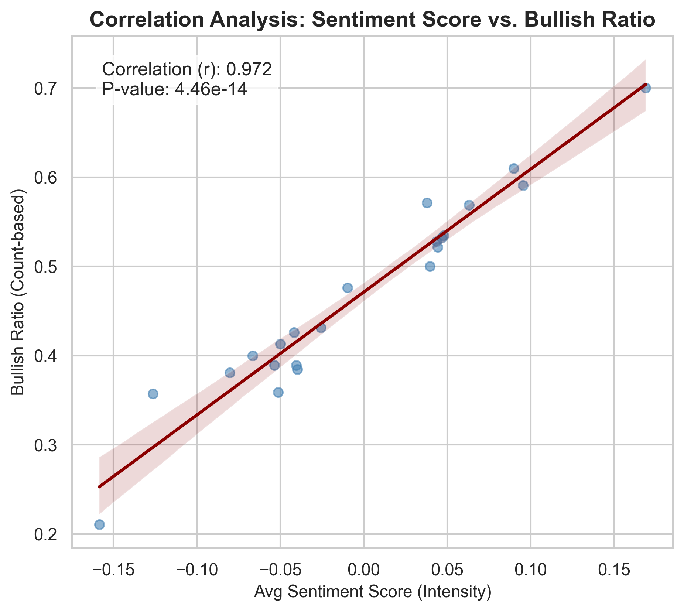

# Financial News Sentiment Analysis & Stock Correlation

## 📖 專案簡介 (Project Overview)
本專案旨在利用自然語言處理 (NLP) 技術分析財經新聞的情緒，並探討該情緒指標與美股主要指數（S&P 500, NASDAQ, Dow Jones, Russell 2000）之間的相關性。

## 💾 資料來源 (Data Source)
本專案使用兩類不同的資料來源：

### 1. 模型訓練資料 (Model Fine-Tuning Data)
* **來源**: [Kaggle - Sentiment Analysis for Financial News](https://www.kaggle.com/datasets/ankurzing/sentiment-analysis-for-financial-news?select=all-data.csv)
* **描述**: 使用該資料集中的 4,846 筆帶有情緒標籤（Positive, Neutral, Negative）的財經新聞標題，對 BERT 模型進行微調 (Fine-tuning)，使其具備判讀財經文本情緒的能力。

### 2. 市場分析資料 (Market Analysis Data)
本專案針對**過去 30 天**的市場動態進行分析，數據獲取分為文本與數值兩條路徑：

* **新聞文本 (News Text Data)**
    * **來源**: Google News (透過爬蟲技術獲取)
    * **範圍**: 過去 30 天
    * **用途**: 獲取標題與摘要，輸入微調後的 BERT 模型以計算每日情緒分數 (Sentiment Score)。

* **市場數值 (Stock Market Data)**
    * **來源**: Yahoo Finance (透過 `yfinance` API)
    * **範圍**: 過去 30 天
    * **用途**: 獲取目標指數的每日收盤價 (Close Price) 與成交量，用於與情緒指標進行時間序列對齊與相關性分析。
## 技術棧 (Tech Stack)
* **語言**: Python 3.x
* **數據處理**: Pandas, NumPy
* **NLP 模型**: BERT (Bidirectional Encoder Representations from Transformers)
* **視覺化**: Matplotlib, Seaborn / Plotly
* **資料來源**: Yahoo Finance (Scraping)

## 專案結構 (Project Structure)
本專案依照數據處理流程分為四個主要步驟：

1.  **01_scraper.ipynb**: 
    * 負責從財經新聞網站爬取標題與內文。
    * 資料清洗與初步格式化。
2.  **02_bert_training.ipynb**: 
    * 載入預訓練 BERT 模型。
    * 針對財經文本進行微調 (Fine-tuning) 或直接推論。
3.  **03_inference.ipynb**: 
    * 將爬取的新聞資料輸入模型，計算情緒分數 (Sentiment Score)。
4.  **04_analysis.ipynb**: 
    * 整合情緒分數與股價數據。
    * 進行時間序列分析與相關性檢定。
    * 產出視覺化圖表。

## 📊 分析結果 (Key Results)
### 相關性熱力圖 (Correlation Heatmap)
| S&P 500 | NASDAQ-100 | Dow Jones (DIA) | Small Cap (IWM) |
| :-: | :-: | :-: | :-: |
| .png) | .png) | .png) | .png) |

