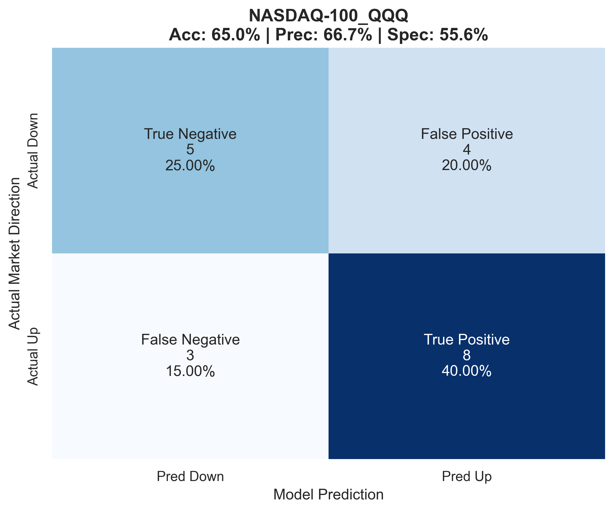
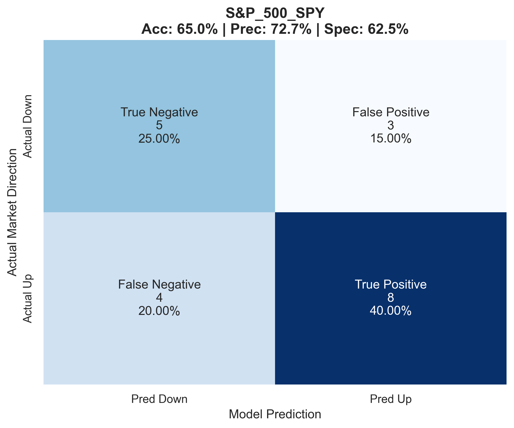

# Financial News Sentiment Analysis & Stock Correlation

The English version of this documentation was translated and refined with the assistance of Large Language Models (LLMs) to ensure clarity and accuracy.
---

<div id="english"></div>

## Project Overview
This project aims to analyze the sentiment of financial news using **Natural Language Processing (NLP)** techniques and investigate the correlation between these sentiment indicators and major U.S. stock indices (S&P 500, NASDAQ, Dow Jones, Russell 2000).

It combines **Data Engineering** (automated scraping pipeline), **Deep Learning** (FinBERT), and **Econometrics** (Dynamic Logit Model) to verify the predictive power of market sentiment.

##  Key Results (Highlights)

### 1. Sentiment Predicts Market Direction
Using a **Dynamic Logit Model**, we found that news sentiment significantly improves prediction accuracy for tech-heavy indices.

* **NASDAQ-100 (QQQ):** Prediction accuracy improved by **+10%** (Baseline 55% $\to$ Model 65%).
* **Statistical Significance:** The sentiment coefficient was significant ($p=0.091$), confirming that yesterday's news sentiment positively correlates with today's market rise.

### 2. Correlation Heatmap
*Sentiment indices show strong correlation with market movements, especially in volatile periods.*

| NASDAQ-100 (QQQ) | S&P 500 (SPY) |
| :---: | :---: |
|  |  |

---

##  Tech Stack
* **Language**: Python 3.8+
* **NLP Framework**: Hugging Face Transformers (FinBERT), PyTorch
* **Data Engineering**: Selenium, BeautifulSoup, yfinance API
* **Statistical Analysis**: Statsmodels (Dynamic Logit), NumPy, Pandas
* **Visualization**: Matplotlib, Seaborn

## 📂 Project Structure
1.  **`01_scraper.ipynb`**: Scrapes headlines/content from Google News (handles IP rotation).
2.  **`02_bert_training.ipynb`**: Loads/Fine-tunes the FinBERT model.
3.  **`03_inference.ipynb`**: Calculates daily Sentiment Scores.
4.  **`04_analysis.ipynb`**: Integrates data, runs Logit regressions, and generates plots.

---

##  How to Run

1.  **Environment Setup**:
    ```bash
    git clone [https://github.com/YOUR_USERNAME/REPO_NAME.git](https://github.com/YOUR_USERNAME/REPO_NAME.git)
    pip install -r requirements.txt
    ```

2.  **Execution Flow**:
    Run the notebooks in numerical order (`01` -> `04`).
    
    > **💡 Pro Tip:** It is highly recommended to run `01_scraper.ipynb` on **Google Colab**. Since Colab assigns a new Dynamic IP each session, this effectively prevents IP blocking from target news websites.

---

##  Methodology & Statistical Verification

<details>
<summary><strong>Click to view: Sentiment Index Construction (Math)</strong></summary>

### 1. Discrete Classification (Bullish Ratio)
Forces headlines into Positive/Negative/Neutral.
$$B_t = \frac{N_{pos}}{N_{pos} + N_{neg}}$$

### 2. Continuous Probability Score
Uses Softmax probabilities from FinBERT logits to preserve confidence levels.
$$S_t = \frac{1}{n} \sum_{i=1}^{n} (P(Pos)_i - P(Neg)_i)$$

</details>

<details>
<summary><strong>Click to view: Dynamic Logit Model Results (Full Table)</strong></summary>

We utilized a Dynamic Logit Model to predict market direction (Up/Down):
$$\ln(\frac{P_t}{1-P_t}) = \alpha + \gamma Y_{t-1} + \beta S_{t-1}$$

**Summary Statistics:**

| Ticker | Model Accuracy | Lift | Sentiment Coeff ($\beta$) | P-value |
| :--- | :---: | :---: | :---: | :---: |
| **NASDAQ-100 (QQQ)** | **65.00%** | **+10%** | **14.61** | **0.091*** |
| **S&P 500 (SPY)** | **65.00%** | +5% | 14.62 | 0.107 |
| Dow Jones (DIA) | 60.00% | +5% | 9.06 | 0.197 |
| Small Cap (IWM) | 60.00% | 0% | 7.99 | 0.281 |

<small>*Note: P-value < 0.1 indicates significance at the 10% confidence level.*</small>

</details>

<br>
<br>

---
---

<div id="chinese"></div>

## 專案簡介 (Chinese Overview)
本專案利用自然語言處理 (NLP) 技術分析財經新聞情緒，並結合計量經濟模型（Dynamic Logit Model），探討情緒指標與美股主要指數（S&P 500, NASDAQ, Dow Jones）之預測相關性。

本專案實作了從**自動化爬蟲**、**BERT 模型推論**到**時間序列分析**的完整資料管線。

##  關鍵分析結果

### 1. 情緒指標具有預測力
透過動態 Logit 模型驗證，我們發現加入情緒指標能顯著提升對科技股指數的預測準確率。

* **NASDAQ-100 (QQQ)**：預測準確率提升 **10%** (基準 55% $\to$ 模型 65%)。
* **統計顯著性**：情緒係數顯著 ($p=0.091$)，證實昨日新聞情緒與今日市場上漲機率呈正相關。

### 2. 相關性熱力圖

| NASDAQ-100 (QQQ) | S&P 500 (SPY) |
| :-: | :-: |
|  |  |

---

##  技術棧 (Tech Stack)
* **語言**: Python 3.8+
* **NLP 模型**: FinBERT (Hugging Face Transformers)
* **資料工程**: Selenium, BeautifulSoup, Google Colab (IP Rotation)
* **統計分析**: Statsmodels (Dynamic Logit), Pandas
* **視覺化**: Matplotlib, Seaborn

##  專案結構
1.  **`01_scraper.ipynb`**: 爬取 Google News 財經新聞（處理反爬蟲機制）。
2.  **`02_bert_training.ipynb`**: 載入 FinBERT 預訓練模型進行微調。
3.  **`03_inference.ipynb`**: 計算每日新聞情緒分數。
4.  **`04_analysis.ipynb`**: 整合股價數據，執行回歸分析與視覺化。

---

## 💻 如何執行 (How to Run)

1.  **安裝依賴**:
    ```bash
    pip install -r requirements.txt
    ```

2.  **執行順序**:
    請依序執行 `notebooks/` 中的 Jupyter Notebook (`01` -> `04`)。

    > **💡 實戰技巧:** 強烈建議在 **Google Colab** 上執行 `01_scraper.ipynb`。由於 Colab 每次啟動都會分配新的動態 IP，這能有效規避目標新聞網站的 IP 封鎖 (IP Blocking) 機制。

---

##  方法論與統計檢定細節

<details>
<summary><strong>點擊展開：情緒指標建構公式 (Math)</strong></summary>

### 模式一：離散標籤 (Bullish Ratio)
$$B_t = \frac{N_{pos}}{N_{pos} + N_{neg}}$$

### 模式二：連續機率分數 (Continuous Probability)
利用 Softmax 機率保留模型信心程度：
$$S_t = \frac{1}{n} \sum_{i=1}^{n} Score_i$$

</details>

<details>
<summary><strong>點擊展開：Dynamic Logit 模型詳細報表</strong></summary>

我們使用時間序列 Logit 模型預測市場漲跌：
$$\ln(\frac{P_t}{1-P_t}) = \alpha + \gamma Y_{t-1} + \beta S_{t-1}$$

**實證結果摘要：**

| 指數 | 模型準確率 | 提升幅度 (Lift) | 情緒係數 ($\beta$) | P-value |
| :--- | :---: | :---: | :---: | :---: |
| **NASDAQ-100 (QQQ)** | **65.00%** | **+10%** | **14.61** | **0.091*** |
| **S&P 500 (SPY)** | **65.00%** | +5% | 14.62 | 0.107 |
| Dow Jones (DIA) | 60.00% | +5% | 9.06 | 0.197 |
| Small Cap (IWM) | 60.00% | 0% | 7.99 | 0.281 |

<small>*註：P-value < 0.1 代表在 10% 信心水準下顯著。*</small>

</details>
